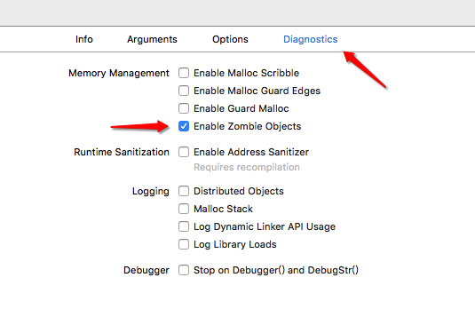
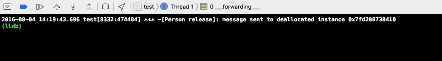

1. Objective-C变量前面加"_"是什么意思？
	- 声明的property如果没有指定synthesize，就会自动声明_开头的实例变量。
	- 假如你声明了一个@property(nonatomic, copy) NSString *name;通过_name进行存取不会调用setter／getter方法，声明的copy也不会起作用，self.name会调用setter／getter方法，copy起作用。
	- @synthesize name ＝ name；就不会生成_name，取而代之的是name。
2. @property内存管理策略
	- 非ARC
		1. copy：只用于NSString/block。
		2. retain：除NSString/block以外的OC对象。
		3. assign：基本数据类型、枚举、结构体（非OC对象），当2个对象相互引用，					一端用retain，一端用assign。
		
	- ARC
		1. copy：只用于NSString/block。
		2. strong：用于除NSString/block以外的对象。
		3. weak：当两个对象互相引用，一端用strong，一端用weak。
		4. assign：基本数据类型、枚举、结构体（非OC对象）。
3. copy/mutableCopy
 - 什么叫做copy：利用原对象产生一个副本对象，（副本对象中的内容和原对象内容一致）修改原对象的属性和行为不会影响副本对象，修改副本对象不会影响原对象。
 - 一般情况下copy/mutableCopy操作会生成一个新的对象，但是不可变对象通过copy不会生成新对象。
 		- 产生新对象的原因：
			1. 修改原对象不会影响副本对象，修改副本对象不会影响原对象。
			2. 不可变对象通过mutableCopy生成可变对象，所以必须生成新对象（可变对象通过copy生成不可变对象同理）。
			3. 可变对象通过mutableCopy生成可变对象，当修改原／副本对象的时候不能相互影响所以要生成新对象。
			4. 不可变对象通过copy生成不可变对象，因为两个对象是都不能修改的，所以不会生成新对象（oc的内存优化）。
		* 注意：
	
			```
			[NSArray mutableCopy] -> NSMutableArray
			[NSMutableArray copy] -> NSArray
			```
	- 正因为copy有时会生成新对象，有时不会生成新对象，所以就出现了浅拷贝与深拷贝
		- 浅拷贝：没有生成新对象，本质就是指针拷贝。
			- 注意：`原对象引用计数＋1(相当于进行retain操作)。`
		- 深拷贝：生成新对象，本质就是创建了一个新对象。
			- 注意：原对象引用计数不变。     
 - 如果想令自己的类支持拷贝操作就要实现NSCopying或NSMutableCopying协议。如果自定义的对象分为可变和不可变两个版本，就要同时实现NSCopying和NSMutableCopying协议。
	- NSCopying协议中只有一个方法（生成不可变对象）
	
		```
		- (id)copyWithZone:(nullable NSZone *)zone;
		```
		举例实现：
		
		```
		//Person.h
		@property (nonatomic, assign) int age;
		@property (nonatomic, copy) NSString *name;
		
		//Person.m
		- (id)copyWithZone:(NSZone *)zone
		{
    		// 1.创建一个新的对象
    		Person *p = [[[self class] allocWithZone:zone] init];
    		// 2.设置当前对象的内容给新的对象
    		p.age = _age;
    		p.name = _name;
    		// 3.返回新的对象
    		return p;
		}
		```
	- 	NSMutableCopying协议中只有一个方法（生成可变对象）
		
		```
		- (id)mutableCopyWithZone:(nullable NSZone *)zone;
		```
		举例实现：
		
		```
		//Person.h
		@property (nonatomic, assign) int age;
		@property (nonatomic, copy) NSString *name;
		
		//Person.m
		- (id)mutableCopyWithZone:(NSZone *)zone
		{
		    // 1.创建一个新的对象
		    Person *p = [[[self class] allocWithZone:zone] init];
		    // 2.设置当前对象的内容给新的对象
		    p.age = _age;
		    p.name = _name;
		    // 3.返回新的对象
		    return p;
		}
		```
	
	- 浅拷贝：只拷贝容器对象本身，而不复制其中的数据。
	
		```
		//Person.h
		@property (nonatomic, assign) int age;
		@property (nonatomic, copy) NSString *name;
		
		//Person.m
		- (id)copyWithZone:(NSZone *)zone
		{
		    // 1.创建一个新的对象
    		Person *p = self;
    		// 2.返回新的对象
    		return p;
		}
		```
	- 深拷贝：在拷贝对象自身的时候，将底层数据也复制过去。
	
		```
		//Person.h
		@property (nonatomic, assign) int age;
		@property (nonatomic, copy) NSString *name;
		
		//Person.m
		- (id)deepCopy
		{
		    // 1.创建一个新的对象
		    Person *p = [[[self class] allocWithZone:zone] init];
		    // 2.设置当前对象的内容给新的对象
		    p.age = _age;
		    p.name = _name;
		    // 3.返回新的对象
		    return p;
		}
		```


	- 复制对象的时候一般执行浅拷贝。
	- 如果你的对象需要深拷贝，应该考虑专门执行深拷贝的方法。
	- 字符串属性都要使用copy。（防止外界修改内部数据）
	- 使用copy保存block，这样可以保住block中使用的外界对象，避免以后调用block的时候，对象已经被外界释放。（Block_release(blcok)，MRC中使用，释放block，并且block中的对象也可以接收到release消息）
		- 注意：copy block之后会产生循环引用（对象中的block又用到了对象自己），为了避免内存泄漏应该讲对象修饰为__block.
	- 子类会继承父类的协议，当父类实现了copy的方法，子类也就相应的实现了。但是如果子类有新的属性，那么必须在子类中重写copyWithZone方法, 在该方法中先调用父类创建副本设置值, 然后再设置子类特有的值。
		- 举例（Son为上文中Person的子类）
			
			```
			Son.h
			@property (nonatomic, assign) double height;
			
			Son.m
			- (id)copyWithZone:(NSZone *)zone
			{
			    // 1.创建一个新的对象
			    id obj = [super copyWithZone:zone];
			    // 2.设置新对象的数据
			    [obj setHeight:_height];
			    // 3.返回新对象
			    return obj;
			}
			```
4. 集合（（可变）数组、（可变）字典、NSSet）对象的内存管理：
	- 将一个对象添加到一个集合中，集合会对对象进行一次retain操作（引用计数加一）。
	- 当集合释放对象之后会给集合中所有的对象发送release消息（引用计数减一）。
	- 当集合移除一个对象之后，会给这个对象发送release消息（引用计数减一）。
5. block默认存储在栈中，栈中的block访问外界对象，不会对外界对象进行retian操作。如果block在堆中，并且访问了外界对象，就会对外界对象进行一次retain操作。

	```
	//将block转移到堆中
	Block_copy(block);
	```
6. 代理设计模式的作用：
	- A对象监听B对象的行为，A成为B的代理。
	- B对象告诉A对象一些信息，A成为B的代理。
7. 代理设计模式的开发步骤：
	1. 创建协议（协议名称的格式：控件名＋Delegate），协议里面声明代理方法（一般代理方法用@optional）。
	2. 声明一个代理属性：@property(nonatomic, weak) id<代理协议>delegate;。
	3. 在内部发生某些行为的时候，调用代理对应的代理方法，通知代理内部发生的事情。
	4. 设置代理：xxx.delegate = yyy;
	5. yyy对象遵守协议，实现代理方法。
	6. 判断是否实现协议的某个方法。
	
	```objc
	if ([self.delegate respondsToSelector:@selector(方法名)]) {
   [self.delegate 方法名];
}
	``` 
8. KVC/KVO
	* KVC(Key Value Coding)：给模型属性赋值。
	* KVO(Key Value Observing)：监听模型属性改变。
		* KVO使用步骤：
		
			```objc
			// b对象监听了a对象的name属性的改变
			[a addObserver:b forKeyPath:@"name" options: NSKeyValueObservingOptionOld context:nil];

			// b对象实现监听方法
			- (void)observeValueForKeyPath:(NSString *)keyPath ofObject:(id)object change:(NSDictionary *)change context:(void *)context
			{
			    //some code
			}
			
			//移除监听
			[a removeObserver:b forKeyPath:@"name"];
			```
9. setter/getter方法
	* setter：给成员变量赋值。
		1. 一定是对象方法。
		2. 一定没有返回值。
		3. 方法名称以set开头, 后面跟上需要赋值的成员变量名称, 并且去掉下划线, 然后首字母大写。
		4. 一定有参数, 参数类型和需要赋值的成员变量一致, 参数名称就是需要赋值的成员变量名称去掉下划线。
	* getter：获取成员变量的值
		1. 一定是对象方法。
		2. 一定有返回值, 返回值类型和需要获取的成员变量的类型一致。
		3. 方法名称就是需要获取的成员变量的名称去掉下划线。
		4. 一定没有参数。
10. @porperty
	- 是一个编译器指令。在Xocde4.4之前, 可以使用@porperty来代替getter/setter方法的声明。从Xcode4.4以后apple对@property进行了一个增强, 以后只要利用一个@property就可以同时生成setter/getter方法的声明和实现。
  - 如果利用@property来生成getter/setter方法, 那么我们可以不写成员变量, 系统会自动给我们生成一个以_开头的成员变量。
  - 注意: 
  		- @property自动帮我们生成的成员变量是一个私有的成员变量, 也就是说是在.m文件中生成的,而不			是在.h文件中生成的。
 		- 如果重写了setter方法, 那么property就只会生成getter方法。
		- 如果重写了getter方法, 那么property就只会生成setter方法。
		- 如果同时重写了getter/setter方法, 那么property就不会自动帮我们生成私有的成员变量。
11. @synthesize是一个编译器指令, 它可以简化我们getter/setter方法的实现。
	1. 在@synthesize后面告诉编译器, 需要实现哪个@property生成的声明。
	2. 告诉@synthesize, 需要将传入的值赋值给谁和返回谁的值给调用者。
	
		```objc
		@synthesize age = _age;
		```
	3. 注意：如果在@synthesize后面没有告诉系统将传入的值赋值给谁, 系统默认会赋值给和@synthesize后面写得名称相同的成员变量。
	
		```objc
		@synthesize age;
		//age有值，_age不会有值。
		```
		不写@synthesize，Xcode4.4之后会自动实现setter/getter方法的实现。@property默认会将传入的属性赋值给_开头的成员变量。
12. property修饰符：
	- 如果给一个属性同时提供了getter/setter方法, 那么我们称这个属性为可读可写属性。
	- 如果只提供了getter方法, 那么我们称这个属性为只读属性。
	- 如果只提供了setter方法, 那么我们称这个属性为只写属性。
	- 如果既没有提供getter也没有提供setter方法, 那么我们称这个属性为私有属性。
	- 对应：readwrite(可读可写属性，property的默认属性);readonly(只读属性);
	- 没有writeonly。
	- 如果想生成私有属性，就不能用property，直接声明为成员变量。
	- setter/getter
		- setter：不常用。
		- getter：一般情况下获取BOOL类型的属性的值, 我们都会将获取的方法名称改为isXXX。
	- retain: 就会自动帮我们生成getter/setter方法内存管理的代码。(见set方法的内存管理)
	- assign: 不会帮我们生成set方法内存管理的代码, 仅仅只会生成普通的getter/setter方法, 默认什么都不写就是assign。（基本不写）
		
		```
		- (void)setAge:(int)age
		{
			_age = age;
		}
		```
	- atomic：性能低。（默认，用于Mac开发）
	- nonatomic：性能高。（用于iOS开发）
		- 注意：不能一起使用的修饰符
			- readonly和readwrite。
			- retain和assign。
			- atomic和nonatomic。
13. 内存管理：(Xcode4.2或以上版本、LLVM编译器3.0或以上版本、编译器中设置ARC为有效状态－>ARC)
	* ARC: Automatic(自动) Reference(引用) Counting(计数)，编译器的特点。编译器会在适当的地方自动给我们添加release/retain等代码。
	* MRC: Manul(手动) Reference(引用) Counting(计数)。自己编写release/retain等代码，一次alloc对应一次release, 一次retain对应一次relese。
	* ARC -> MRC
		

	* 管理范围：
		* 任何继承了NSObject的对象。
		* 对其他非对象类型无效。(int、char、float、double、struct、enum等) 
		* 原因：
			* OC对象存放在队里面。(堆里面的数据不会自动释放，需要手动释放。只有OC对象才需要进行内存管理根本原因)
			* 非OC对象一般存放在栈里面。(栈里的数据会自动释放)
			* 栈(OS)：由OS自动分配释放，存放函数的参数值，局部变量的值等。操作方式类似于数据结构中的栈。
			* 堆(OS)：一般由程序员释放，若程序员不释放，程序结束的时候可能又OS回收。分配方式类似链表。
	* 引用计数器：每一个OC对象都会存在一个引用计数器，它是一个整形，占用4个字节。表示当前对象被引用的次数。
		* 引用计数器为0的时候，对象的内存才会被系统回收。
		* 任何一个对象刚被创建完，引用计数为1。
			* 当使用alloc、new、copy、mutableCopy创建对象的时候，对象的引用计数为1。
		* 引用计数器的操作：
			* 给对象发送一条retain消息，引用计数器+1。（retain方法返回对象本身）
			* 给对象发送一条release消息 ，引用计数器-1。(release不是销毁/回收对象，就是让引用计数器-1)
			* 给对象发送retainCount消息，获得当前对象的引用计数器的值。(获取到的引用计数不准确，判断一个对象是否被释放要通过dealloc方法)
				* dealloc方法：当一个对象的引用计数为0的时候（对象要被释放），系统会自动调用（不能手动调用）dealloc方法。
					* dealloc方法的重写：一旦重写dealloc方法就必须调用[super dealloc],并且要在最后调用。
		* 僵尸对象：只要一个对象被释放了, 我们就称这个对象为僵尸对象。
			* 开启监听僵尸对象：
			
				
				

				

			- 错误：消息发送给已经释放的实例对象。
			

		* 野指针：当一个指针指向一个僵尸对象, 我们就称这个指针为野指针。
			* 只要给一个野指针发送消息就会报错。(EXC_BAD_ACCESS错误)
		* 空指针：将指针设置为0/nil。为了避免给野指针发送消息会报错, 一般情况下, 当一个对象被释放后我们会将这个对象的指针设置为空指针，因为在OC中给空指针发送消息是不会报错的。
			* 为了避免野指针错误，在对象被销毁之后，我们可以将对象的指针设置为空指针。
		* set方法的内存管理：
			* retain：release旧值，retain新值。（用于OC对象）
			* assign：直接赋值，不做任何内存管理。（用于非OC对象）
			* copy：release旧值，copy新值。（一般用于NSString）
		
		```objc
		//固定写法
		- (void)setRoom:(Room *)room // room = r
		{
		    // 只有房间不同才需用release和retain
		    if (_room != room) {
		        // 将以前的房间释放掉 -1
		        [_room release];
		        // retain不仅仅会对引用计数器+1, 而且还会返回当前对象
		        _room = [room retain];
		        /*
		        //这种写法等于_room = [room retain];
        		[room retain];
        		_room = room;
         		*/
		    }
		}
		``` 		   		 		 		


